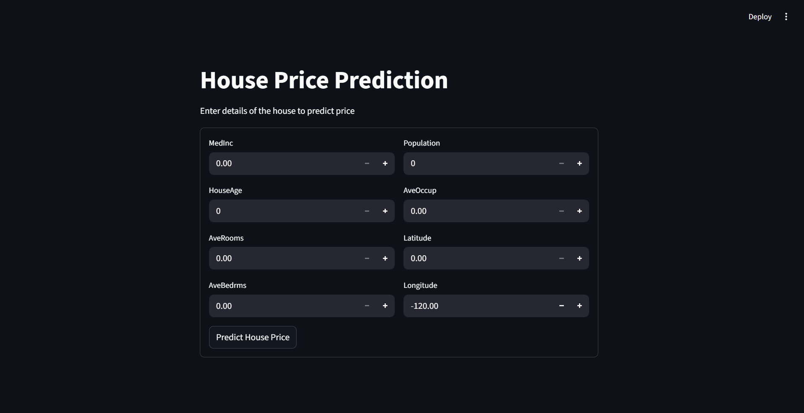

# House Price Predictor

## 📋 Overview

An end-to-end machine learning system designed to predict house prices using the [California Housing Dataset](https://www.kaggle.com/competitions/regression-tabular-california-housing) from Kaggle. The project follows a complete MLOps pipeline from exploratory data analysis to production deployment.

The project begins with comprehensive notebook-based experiments for EDA, data preprocessing, model training with hyperparameter tuning using Optuna, and model evaluation. During experimentation, CatBoostRegressor, XGBRegressor, and LGBMRegressor emerged as the top three models, which were combined into a StackingRegressor achieving an MSE of 0.043, MAE of 0.155, RMSE of 0.208, and an R2 score of 0.66. These experiments are then converted into modular Python scripts implementing a robust data pipeline: data ingestion from AWS S3, preprocessing, model training, and evaluation with MLflow for experiment tracking, all orchestrated with DVC.

The trained StackingRegressor model is served through a FastAPI backend with a `/predict` endpoint, providing real-time house price predictions. The entire API is containerised with Docker for consistent deployment.

A responsive Streamlit frontend provides an intuitive interface for users to input house features (median income, house age, rooms, population, location) and receive instant price predictions. The frontend is also containerised for seamless deployment.

Finally, the container is deployed on AWS infrastructure using Elastic Container Registry (ECR) for image storage and Elastic Container Service (ECS) with Fargate for serverless container orchestration, creating a fully cloud-deployed ML system.

## 🏗️ Architecture

## 🛠️ Tech Stack

- **Frontend:** Streamlit
- **Backend:** FastAPI
- **ML:** Scikit-learn, CatBoost, XGBoost, LightGBM, Optuna, DVC, MLflow
- **Infrastructure:** Docker, AWS ECR, ECS
- **Data:** Pandas, NumPy, AWS S3

## 🚀 Features

- Real-time house price prediction via web interface
- RESTful API with automatic documentation
- Modular ML pipeline with DVC
- Experiment tracking with MLflow
- Containerised deployment with Docker
- Cloud deployment on AWS ECS

## 📊 Model Performance

After experimentation, a **StackingRegressor** combining CatBoost, XGBoost, and LightGBM performed best:

| Metric       | Score |
| ------------ | ----- |
| **MSE**      | 0.043 |
| **MAE**      | 0.155 |
| **RMSE**     | 0.208 |
| **R2 Score** | 0.66  |

### Prerequisites

- Python 3.8+
- Docker
- AWS Account (for deployment)
- AWS CLI configured (for S3 access)
